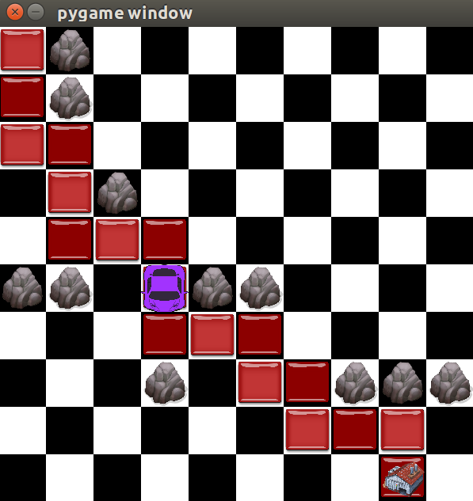
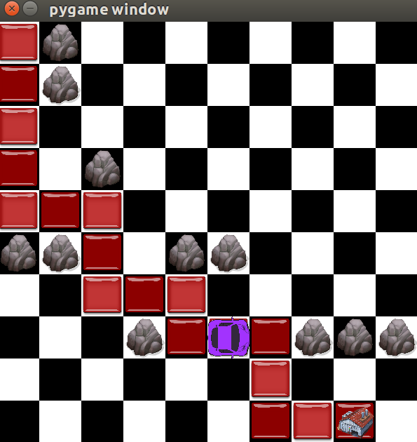

# Heuristic Path Planning with A* and Deep Q Networks

As a team of four, we worked on the comparison and visulization of path planning problem.
The responsibilities were the following (if there are any questions to one of the modules, feel free to contact to us)
- Reza - Visualization of agent + behaviour for simple model & complex model
- Till Soehlemann - Implementation of qlearning pipelines for simple model & complex model; Development of single-track model
- Abu - Make qlearning models deep + add multiple layers
- Emrecan Tarakci - A-Star Algorithm for grid model, reward mechanism for DQN

## Getting Started

First of all, to see the visualized A Star approach with two different heuristics, namely Euclidean Distance and Manhattan Distance, you need to run pathfinder.py which requires AStar_Visualization.py. 

The size of the grid, the obstacles, coordinates of starting point and the goal point can be modified in pathfinder.py. 
The car finds the shortest path -smallest cost- in a timely manner. Of course, this depends on the heuristics that we are using, but for our 2D grid problem with some obstacles, it outperformed DQN approach.

In addition, in visualization you may see the different heuristics and their path to goal. 

Secondly, To train the simple q-learning module, run train_agent.py. The car learns to find a goal in a two-dimensional grid with random obstacles.

The size of the grid, the obstacles and the goal can be modified in train_agent.py.

The visualization shows, how the car converges from an exploration phase (many random movements) to an exploitation phase and finally ends up in figuring out efficient paths to the goal.

The downside of using qlearning is obviously the training time: in such a simple scenario, it would be more feasible using a simple heuristic in order to find the optimal path.

However, this simple model is a perfect example for getting to know how q-learning works and getting an idea of how it could be applied to more advanced problems.

Finally, We also implemented a more complex q-learning module, which does not use a discretized grid, but a more complex and high-dimensional environment.

Here, the movements are restricted by a single track model, defined by the length L of the car, the steering angle phi, the configuration angle theta and the position of the car and a goal line.

It can be seen that the movements of the car are more realistic, but also that the model is way more complex and unfortunately does not behave optimally.

## Prerequisites

What things you need to install the software and how to install them

Tensorflow: pip install tensorflow

## Visualization Process
The visualization process incorporates a two dimensional grid having the co-ordinates of the obstacles in it. For the design of the simple Q Learning based agent and A-Star implemmentation the Grid has been used as the traning space. 

In case of simple Q Learning based agent, the Agent (i.e., the car) starts it's journey from the starting coordiante which has been provided by the system. The goal is also fixed. We have four agent configuration for the facing of the car/agent.

- For agent_config 0, it faces towards right/forward, rotation of 0 degree 
- For agent_config 1, it faces towards top of the current cell, rotation of 90 degree 
- For agent_config 2, it faces towards left/backward, rotation of -180 degree 
- For agent_config 3, it faces towards down of the current cell, rotation of 270 degree 

for the A - Star implementation, the scenerio is slightly different. Although the agent facing and the 2D Grid world is same , but the visualization process is not same. In A - Star implementation, we've shouwn the path construction of the car from the starting point towards the Goal position. The heuristic technique has been applied using the Manhattan distance and Euclidean Distance. Obviously , the co-ordinate list of the obstacles are also present in this visualization model too.

## Visualization Methods
For the simple Q Learning based agent movemment, the *Visualization Class* in the *Simplified_Agent_Visualization.py* file defines the update() method which takes the co-ordinate list of the ostacles, agent/car's updated position (x, y) and the agent configuration as the parameter. 

#*agent_grid_movement_visualization()*

This method is responsible for creating the 2D World cordinate system where the car will navigate and learn. The obstacles are distributed in the screen according to the dynamic coordinate provided from the update() method. We've used the *pygame* framework for visualizing the rectangles, grids and animations. The agent and the goal position is also configured here. 

After the displacement of the agent according to the updated (x,y) coordinate, the car is redrawn in the 2D Grid. We have created the frames in 0.05 secs interval, to show the  movement and learning procedure of the car.

#*rotatingTheta()*

This method is responsible for updating the car position according to the updated agent configuration angle. It returns the transformed image of rotated car.

In the A - Star implementation, the visualizaton methods are almost same. A few changes have benn made for showing the path constrauction of the car. The system provided the car's updated  (x,y) position and the list of the so far visited co-ordinates. Then the *agent_grid_movement_visualization()* method in the *AStar_Visualization.py* file draws the visited paths in the GRID with obstacles and agent's new position.   

In below, there are some snippets of the visualizaton process is given : 

## Visualization Snippets: 

A\* with Euclidean Distance as Heuristic Technique:

A\* with Manhattan Distance as Heuristic Technique:

)

## Authors

Reza, Abu, Emrecan Tarakci, Till Soehlemann
